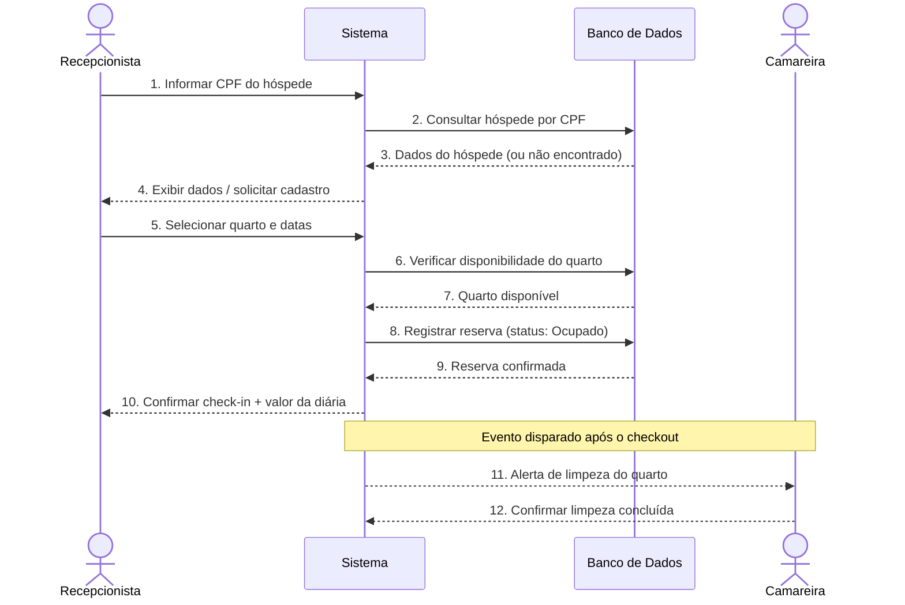
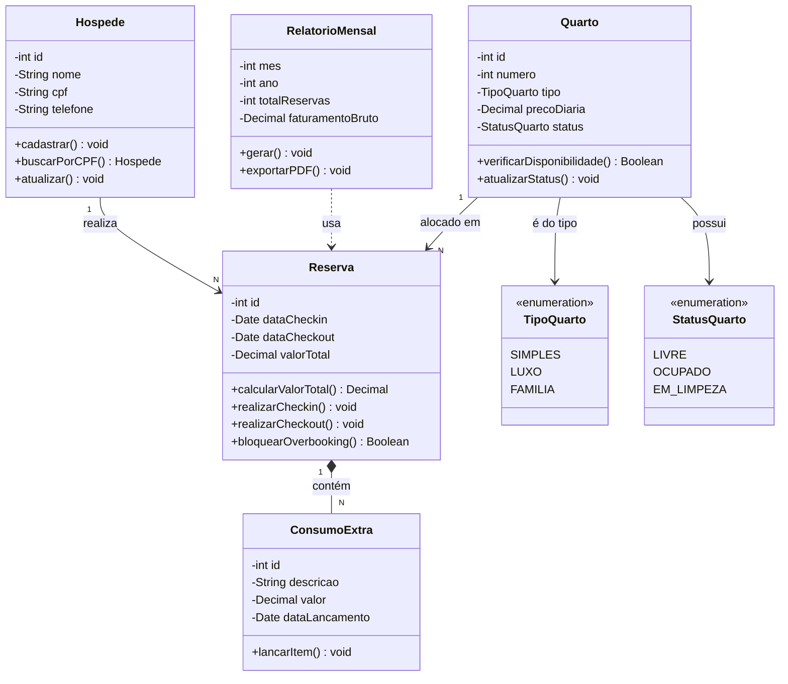
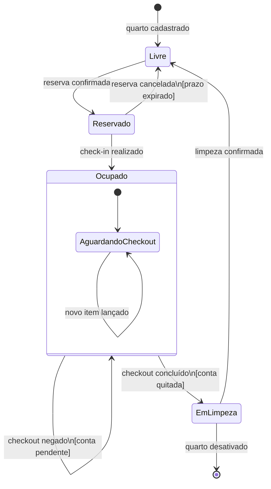

# 🏗️ PIM — Platform Independent Model: Hotel Bela Vista

> **Curso:** Tecnologia em Sistemas para Internet | **Módulo:** 3  
> **Componente Curricular:** Engenharia de Software  
> **Professor:** Gaio B. Oliveira  
> **Atividade:** Semana 05 — Modelagem UML (Perspectivas do Time)  
> **Projeto:** Sistema de Gestão Hoteleira — Hotel Bela Vista

---

## Sumário

1. [Perspectiva de Interação — Diagrama de Sequência](#1-perspectiva-de-interação--diagrama-de-sequência)
2. [Perspectiva Estrutural — Diagrama de Classes](#2-perspectiva-estrutural--diagrama-de-classes)
3. [Perspectiva Comportamental — Diagrama de Estados](#3-perspectiva-comportamental--diagrama-de-estados)

---

## 1. Perspectiva de Interação — Diagrama de Sequência

> **Responsável:** Estudante 1  
> **Escopo:** Processo de check-in do hóspede, desde a consulta de CPF até o alerta de limpeza pós-checkout.

**Decisões de modelagem:**
- A consulta por CPF antes da reserva implementa a regra RF02 (reconhecimento de hóspede recorrente).
- O passo 8 inclui o bloqueio de overbooking, seguindo RF06 — o sistema verifica disponibilidade antes de registrar.
- O alerta de limpeza (passo 11) é um evento assíncrono disparado automaticamente após checkout, atendendo RF12.

---

## 2. Perspectiva Estrutural — Diagrama de Classes

> **Responsável:** Estudante 2  
> **Escopo:** Estrutura estática do sistema — classes, atributos, métodos e relacionamentos.

**Decisões de modelagem:**
- A composição (`*--`) entre `Reserva` e `ConsumoExtra` garante que os itens de consumo não existem sem uma reserva (RN03).
- `TipoQuarto` e `StatusQuarto` são enumerações para evitar valores arbitrários e garantir consistência (RN01, RN02).
- O método `bloquearOverbooking()` em `Reserva` encapsula a regra RF06 diretamente na classe responsável.

---

## 3. Perspectiva Comportamental — Diagrama de Estados

> **Responsável:** Estudante 3  
> **Escopo:** Ciclo de vida completo de um quarto — todos os estados possíveis e as transições entre eles.

**Decisões de modelagem:**
- A transição `Ocupado → EmLimpeza` só é permitida com a guarda `[conta quitada]`, implementando RN03.
- A transição `EmLimpeza → Livre` só ocorre após confirmação explícita da camareira, implementando RN02.
- O estado `Reservado` tem uma transição de saída para `Livre` por cancelamento, cobrindo o caso de no-show.
- O estado final (`[*]`) representa a desativação permanente do quarto (ex: reforma, remoção do sistema).

---

## Síntese do PIM

| Diagrama | Perspectiva | O que modela |
|---|---|---|
| Sequência | Interação | Como os objetos trocam mensagens durante o check-in |
| Classes | Estrutural | Quais entidades existem, seus dados e responsabilidades |
| Estados | Comportamental | Como o quarto muda de estado ao longo do tempo |

> **Nota:** Este PIM é independente de plataforma — não menciona linguagem de programação, banco de dados específico ou tecnologia de interface. Essas decisões serão tomadas no PSM (Platform Specific Model) na próxima etapa.

---

*📁 Repositório: `semana-09/pim-diagramas-uml.md`*  
*🗓️ Atividade: Modelagem UML — Engenharia de Software*
