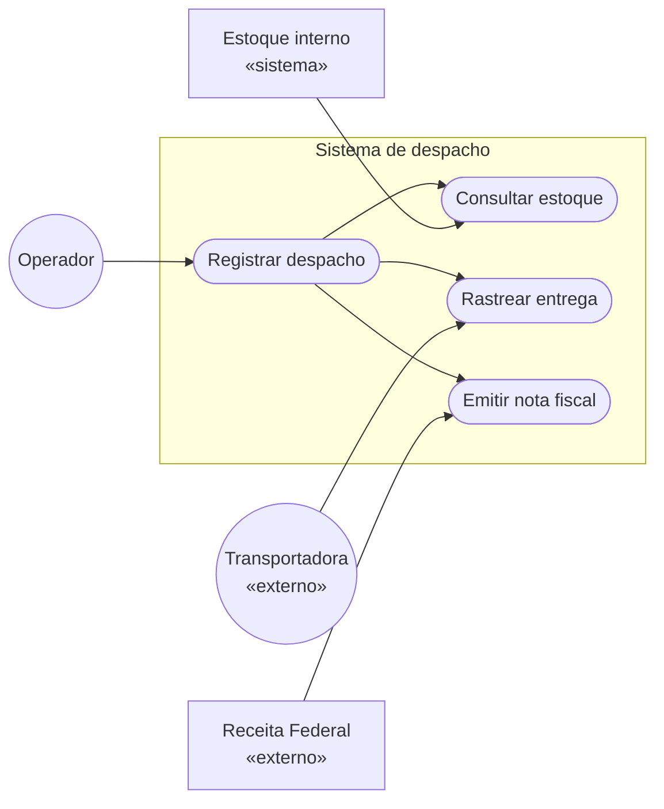
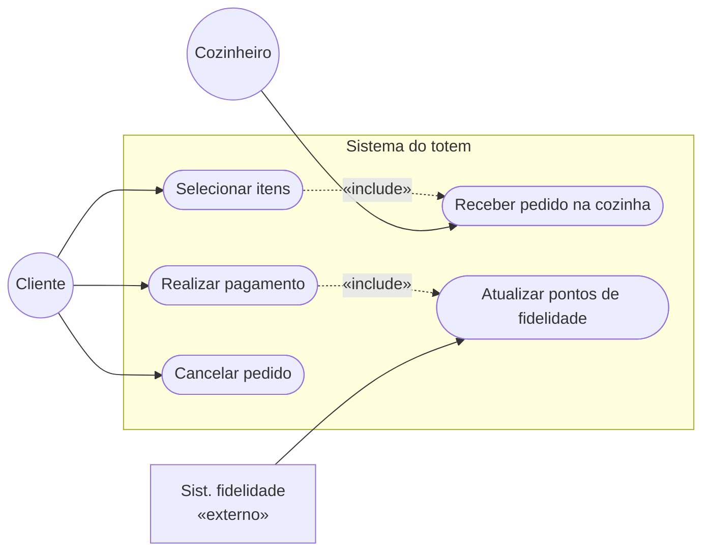
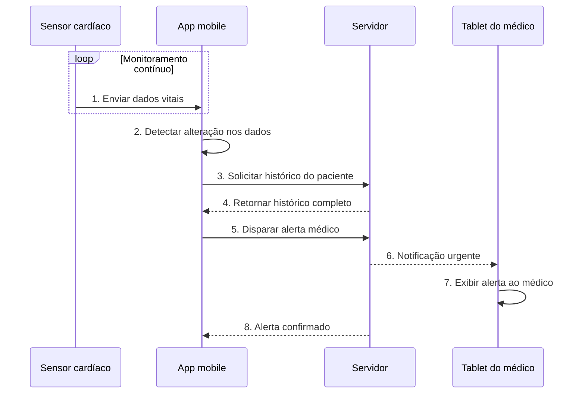
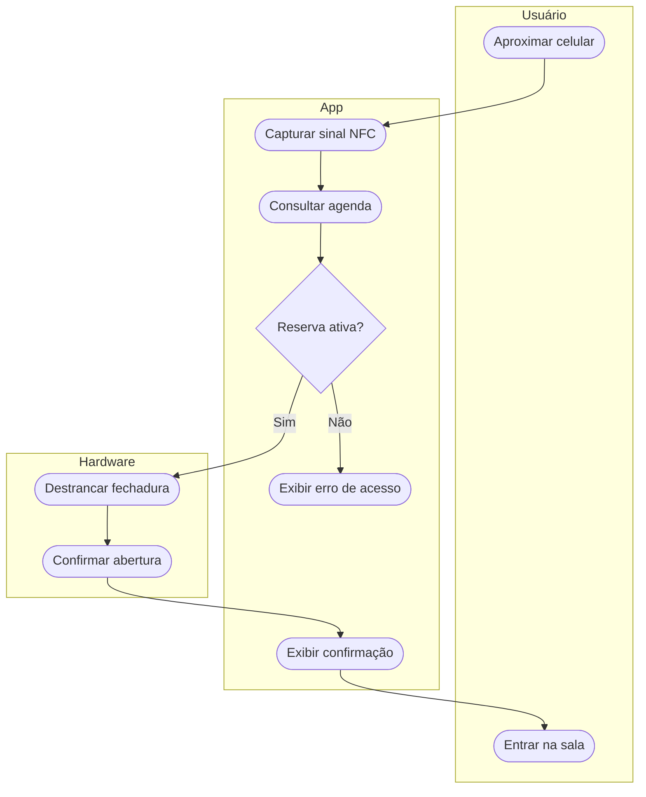
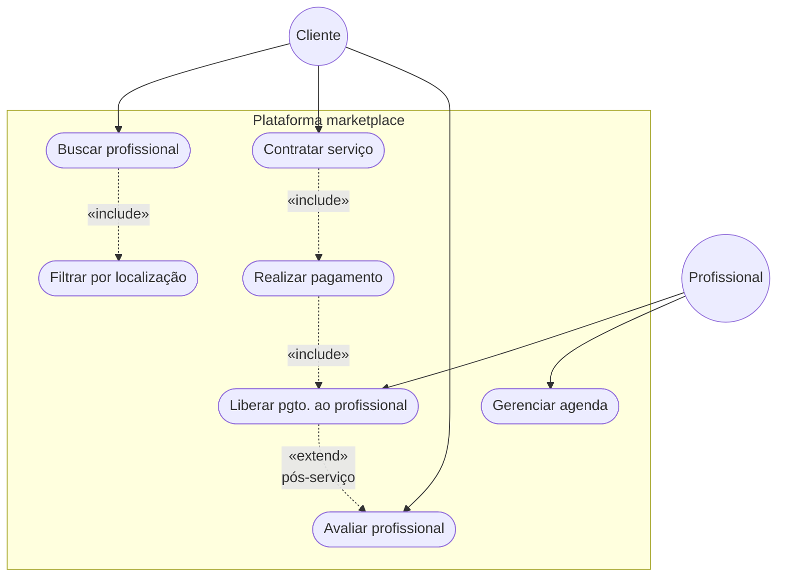

# 📐 Exercícios de revisão — Semana 10

> **Curso:** Tecnologia em Sistemas para Internet | **Módulo:** 3  
> **Componente Curricular:** Engenharia de Software  
> **Professor:** Gaio B. Oliveira | **Data:** 28/04/2026

---

## Sumário

1. [Cenário 1 — Logística de e-commerce global](#cenário-1--logística-de-e-commerce-global)
2. [Cenário 2 — Totem de autoatendimento fast-food](#cenário-2--totem-de-autoatendimento-fast-food)
3. [Cenário 3 — Sistema de telemedicina](#cenário-3--sistema-de-telemedicina)
4. [Cenário 4 — Controle de acesso inteligente](#cenário-4--controle-de-acesso-inteligente)
5. [Cenário 5 — Marketplace de serviços domésticos](#cenário-5--marketplace-de-serviços-domésticos)
6. [Reflexão: o cenário mais desafiador](#reflexão-o-cenário-mais-desafiador)

---

## Cenário 1 — Logística de e-commerce global

**Diagrama:** Caso de Uso  
**Foco:** Fronteiras do sistema e dependências externas

**Decisão de fronteira:**

| Dentro do sistema | Fora do sistema (atores externos) |
|---|---|
| Registrar despacho | Operador logístico (humano) |
| Consultar estoque | Sistema de estoque interno (legado) |
| Rastrear entrega | API da transportadora |
| Emitir nota fiscal | Receita Federal (SEFAZ) |

> O maior desafio aqui é perceber que o **Sistema de Estoque** é um ator externo — ele já existe e o novo sistema apenas o consulta, sem controlá-lo.

---

## Cenário 2 — Totem de autoatendimento fast-food

**Diagrama:** Caso de Uso  
**Foco:** Atores e valor entregue para cada um

**Valor entregue por ator:**

| Ator | Valor recebido do sistema |
|---|---|
| Cliente | Autonomia no pedido e pagamento sem fila |
| Cozinheiro | Pedidos chegam digitalmente, sem erro de comunicação |
| Sist. de fidelidade | Atualização automática de pontos a cada compra |

---

## Cenário 3 — Sistema de telemedicina

**Diagrama:** Sequência  
**Foco:** Ordem cronológica exata das mensagens

**Quem fala com quem:**

| De | Para | Mensagem | Tipo |
|---|---|---|---|
| Sensor | App | Dados vitais | Contínuo (loop) |
| App | Servidor | Solicitar histórico | Síncrono |
| Servidor | App | Histórico do paciente | Retorno |
| App | Servidor | Disparar alerta | Síncrono |
| Servidor | Tablet médico | Notificação urgente | Assíncrono |

---

## Cenário 4 — Controle de acesso inteligente

**Diagrama:** Atividades com swimlanes  
**Foco:** Fluxo lógico e decisões por responsável

**Raias e responsabilidades:**

| Raia | Responsabilidade |
|---|---|
| Usuário | Iniciar o processo (aproximar) e usufruir o resultado (entrar) |
| App | Toda a lógica: captura NFC, consulta agenda, exibe resultado |
| Hardware | Executar o comando físico de destravar a fechadura |

> A decisão `Reserva ativa?` fica no **App** — ele é quem tem acesso à agenda e conhece as regras. O hardware apenas obedece comandos.

---

## Cenário 5 — Marketplace de serviços domésticos

**Diagrama:** Caso de Uso com `«include»` e `«extend»`  
**Foco:** O que é obrigatório e o que é opcional

**Include vs Extend:**

| Relação | Entre | Significa |
|---|---|---|
| `«include»` | Buscar → Filtrar | Toda busca **sempre** aplica filtros |
| `«include»` | Contratar → Pagar | Não há contrato sem pagamento |
| `«include»` | Pagar → Liberar pgto. | Pagamento **sempre** libera o profissional |
| `«extend»` | Liberar → Avaliar | Avaliação é **opcional** — pode ou não ocorrer após o serviço |

> A avaliação usa `«extend»` porque é opcional — o cliente pode receber o serviço e não avaliar. Se fosse obrigatória, seria `«include»`.

---

## Reflexão: o cenário mais desafiador

**O Cenário 1 (Logística de e-commerce)** é o mais desafiador para definir o que está "fora" do sistema, porque:

1. O **Sistema de Estoque** parece interno mas é um ator externo — o sistema de despacho apenas consulta, não controla.
2. A **Receita Federal** é um serviço externo obrigatório, não uma escolha — isso cria uma dependência que não pode ser ignorada no design.
3. A **Transportadora** é externa mas precisa de integração em tempo real, o que levanta questões sobre quem é responsável por falhas de comunicação.

Definir a fronteira errada nesses casos leva a sistemas que tentam fazer tudo e acabam não integrando bem com nada.

---

*📁 Repositório: `semana-10/exercicios-revisao-diagramas.md`*  
*🗓️ Atividade: Exercícios de revisão — Modelos de Contexto e Interação*
